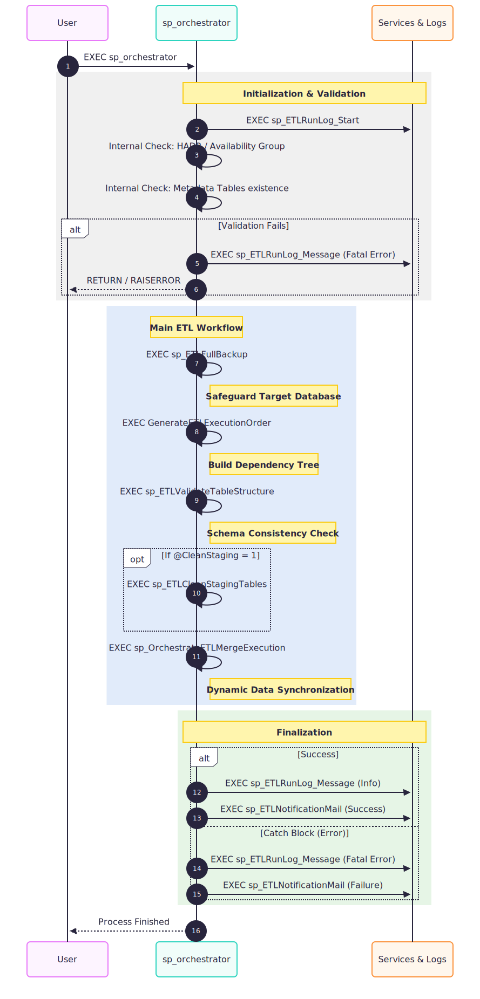

# Data-Migration-Framework
Advanced ETL architecture for incremental data synchronization between production and test environments. Engineered for seamless data migration without structural modifications, ensuring system integrity and operational continuity.
## Disclaimer & Purpose
This project was developed as a **bespoke solution** for a specific database environment and architecture. Due to its highly tailored nature, it is not intended for universal deployment. 

The primary objective of this repository is to **demonstrate advanced T-SQL engineering proficiency**, showcasing complex procedural logic, dynamic orchestration, and robust database management at an enterprise level.

## Process Architecture & Logic

The system is built around a **Central Orchestrator** (`sp_orchestrator`), which manages the entire execution lifecycle, ensuring data consistency and operational stability through a modular pipeline.

### 1. Initialization & Validation
Before any data movement occurs, the system performs a rigorous pre-flight check:
* **Environment Audit:** Validates HADR and Availability Group status to ensure environment readiness.
* **Integrity Check:** Verifies the existence of metadata and control tables.
* **Telemetry Startup:** Initializes the execution trace through the logging services.

### 2. Main ETL Workflow (The Core)
The orchestrator manages a sequence of high-impact operations designed for safety and efficiency:
* **Safeguard Protocol:** Automatically triggers a backup of the target database before execution.
* **Dynamic Dependency Mapping:** Builds a real-time dependency tree to determine the precise execution order, respecting relational integrity.
* **Schema Consistency:** Performs a deep validation of table structures between source and target environments.
* **Incremental Synchronization:** Executes the core migration logic, synchronizing data from Production to Staging/Test environments without altering the underlying system structure.

### 3. Finalization & Resilience
The process concludes with a dedicated reporting and error-handling layer:
* **Success Path:** Logs completion metrics and dispatches automated success notifications.
* **Global Error Handling:** A robust `CATCH` block captures fatal errors, logs the full stack trace, and triggers immediate failure alerts.
---

> This repository is for **viewing purposes only**.
